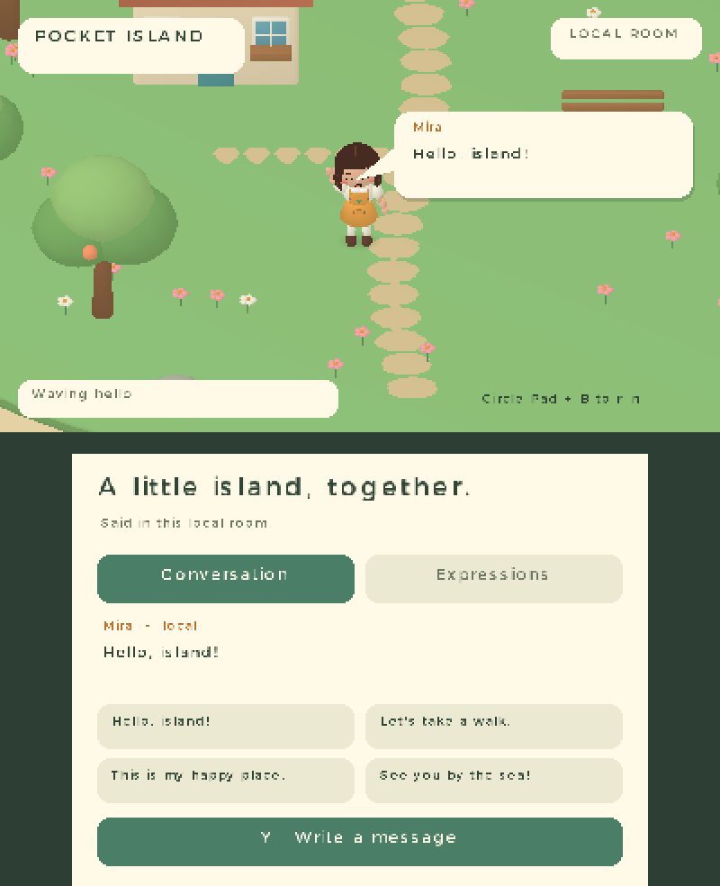
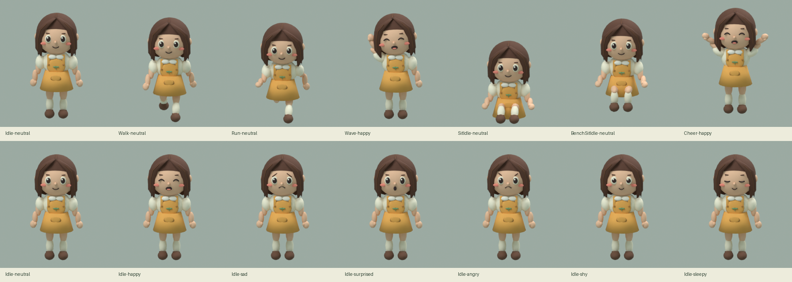

# Pocket Island

A native **Pocket3D social island prototype for Nintendo 3DS**. The upper
400 × 240 screen renders a walkable island and Mira, an original chibi girl
with center-parted, shoulder-length chestnut hair. The lower 320 × 240 screen
contains conversation, a keyboard button, quick phrases, expressions and emotes.



## Run

From the repository root, with Bun, Docker, and Rust installed:

```sh
rustup toolchain install nightly-2026-07-02 --profile minimal --component rust-src
cargo fetch --locked --manifest-path hosts/psp/Cargo.toml
bun island build
bun island run
```

`build` writes **`dist/island/release/pocket-island.3dsx`**. Copy that file to
`sdmc:/3ds/pocket-island/pocket-island.3dsx` and launch it through the Homebrew
Launcher. Assets are embedded; there is no separate asset folder to install.
`run` opens the same build in the installed Azahar application on macOS.
`START` exits to the Homebrew Launcher.

| Control | Behavior |
| --- | --- |
| Circle Pad / D-pad | Walk on the upper screen |
| Hold B | Run |
| A | Wave toward the camera |
| X | Sit / stand; use the bench when within reach |
| Y | Open the 3DS software keyboard and send text |
| L / R | Previous / next facial expression |
| L + R + SELECT | Open / close the native performance panel |
| Lower screen | Send quick phrases, select expressions, wave, sit or cheer |

**This build has one local visitor.** Sending text adds a local conversation
entry and a seven-second bubble attached to Mira's animated head. It does not
connect to a server, transmit voice, or represent another player's avatar.
The UI identifies the room and delivery as local.

## Connected development

**The running native app reuses Pocket Runtime's authenticated TCP transport
on port 8131.** It uses the console's existing `pocketjs/runtime/dev.key`.
Pair an unpaired console once with `bun tools/3ds-dev.ts pair --host <ip>`
while ftpd is open, then launch Pocket Island. After this native version is
installed, screenshot requests, performance reads and application JavaScript
updates run over the development connection.

```sh
bun island probe --host <ip>       # dual-screen GPU capture and live timings
bun island dev --host <ip>         # watch app.js and replace it after edits
bun island push --host <ip>        # replace app.js once
bun island bench --host <ip>       # bounded remote movement/emote tape
```

`--key <file>` selects an existing pairing key from another checkout.
Without `--host`, the tool discovers a paired `p3d-island` target.
Screenshots and measurement receipts go to `dist/island/hardware/`.
**Remote input receipts identify tool-driven actions**, not physical gestures.

`app.js` owns the title, room label, quick phrases, message handling, expression
selection and emote commands. The host runs these callbacks on input events;
the per-vertex animation and rendering loops remain native. A script reload
preserves the world, position, animation and conversation. A candidate context
must evaluate, expose the versioned application object and pass its validation
event before replacement. Source is bounded to 8192 bytes, each context to
4 MiB, and execution uses a 50 ms interrupt deadline. Invalid candidates retain
the current context. Accepted scripts are saved in the native app's own storage
directory with the preceding source available as a boot fallback.

The native adapter reports ABI 0 and rejects `.pocket` guest uploads; use
`bun island push` for its application script. It does not advertise the retained
PocketJS UI tree inspector. Changes to Rust/C, renderer or embedded Blender
assets require a new `.3dsx` and a restart. They cannot be replaced through the
JavaScript update command.

## Measure on a console

**`L + R + SELECT` opens a performance panel on the lower screen.** It uses
the same shortcut as Pocket Runtime, but is owned by this native host. This
example links the shared development transport and exposes native performance
and application controls through its own adapter.
`B` closes the panel, `X` saves the measurements, and `START` saves and exits
to Homebrew Launcher. Circle Pad movement continues while the panel is open.

Measurements run with the panel closed. Walk, run, sit and send a message for
at least 30 seconds, then press `START`. Open ftpd and retrieve
**`sdmc:/pocket-island/perf.csv`**. The next save replaces that report.
The report contains the last 180 completed sampling windows and records the
build revision, console model query and capture-build flag. A capture build
cannot establish console performance; use `dist/island/release/` on hardware.

The host measures submitted frame intervals with `svcGetSystemTick`, including
GPU and vertical-blank waiting. Each window of at least one second reports
FPS, mean / p95 / maximum frame time, update plus CPU skinning, vertex upload,
3D plus UI submission, frame-end cache flushing, wait time, triangle count and
simulation ticks per rendered frame. The fixed **30 Hz simulation rate is
independent of measured FPS**. `C3D_GetDrawingTime` is sampled after the previous
GPU queue completes; that overlapping queue duration must not be added to CPU
stage times. Panel visibility is recorded per window because replacing the
conversation UI changes rendering cost.

Simulation catch-up samples the skeleton on each fixed step and skins the
final pose once for presentation. The regression test compares every output
vertex with per-step skinning through walking, running, sitting and waving.

Samples remain in a bounded RAM buffer during gameplay. SD writes occur on
`X` in the panel or on exit. Keyboard, script replacement and screenshot
readback pauses reset the partial
sampling window. A forced shutdown loses unsaved samples.

## Character source



`assets/pocket-island.blend` contains the character, rig, action library and
island. `assets/mira.glb` retains the skin and all **18 named clips**:

- Idle, Walk, Run, Wave and Cheer.
- SitDown, SitIdle and StandUp for the ground.
- BenchSitDown, BenchSitIdle and BenchStandUp for the bench.
- Expression_neutral, Expression_happy, Expression_sad, Expression_surprised,
  Expression_angry, Expression_shy and Expression_sleepy.

Body motion and the selected facial layer are sampled on separate paths.
Blinking uses a dedicated face layer. Changes of body action blend over
160 ms; a facial change preserves the body animation clock. The character uses
rigid weights on rounded body pieces, with named hand, head and hair bones. The `chat.anchor` bone follows the head
and keeps bubbles outside the character silhouette.
All geometry, materials and clips were authored in Blender for this example
and are covered by the repository's MIT license.

```sh
bun island assets
bun engine/pocket3d/examples/island/scripts/validate_assets.ts
```

The generator requires **Blender 5.1**; `BLENDER` overrides its executable path.
It writes the editable `.blend`, self-contained GLBs, P3M1 assets, generated
collision layout, manifest and rendered previews. The P3M1 profile contains
triangle indices, vertex colors, rigid joint assignments, bind transforms and
linear TRS channels. No Blender or glTF parser runs on the handheld.

## Ownership

| Location | Owns |
| --- | --- |
| `crates/pocket3d-anim` | Shared Pocket3D animation sampling, hierarchy evaluation, bounded P3M1 decoding and CPU skinning; builds with `no_std + alloc` |
| `crates/pocket3d/src/anim.rs` | Existing desktop import path, re-exporting the same sampler |
| `backends/citro3d` | Colored triangle buffers, PICA200 shader and depth / blend state |
| `examples/island/src` | Fixed 30 Hz application state, collision, locomotion, emotes, face selection and conversation |
| `examples/island/app.js` | Replaceable application labels, message handling and interaction commands |
| `examples/island/3ds` | Native lifecycle, controller mapping, dual-screen UI, software keyboard, script adapter and C ABI |
| `hosts/3ds/src/devserver.c` | Shared paired discovery, authenticated control, bounded socket pump and screenshot transport |
| `examples/island/assets` | Blender source, exported character / island and generated scene layout |

The native example does not run a PocketJS guest and is not a `.pocket`
package. It adds a Pocket3D rendering path for the PICA200. The existing
PocketJS 3DS host and guest package lifecycle retain their own build target.

## IM boundary for the next implementation

`Chat` accepts UTF-8 messages of **1–192 bytes**, keeps **32 entries**, limits
local sends to **two per second**, and expires each head bubble after
**210 simulation ticks**. It rejects control characters and directional text
controls, retains pending sends under history pressure, and rejects unknown
senders and duplicate / older per-sender sequence numbers. Incoming and outgoing
messages pass through the same conversation state. Text remains plain text.

`Message` carries the sender ID, sequence number, local receive tick and
`Local`, `Pending`, `Delivered` or `Failed` status. `add_peer`, `receive` and
`acknowledge` are transport entry points; the local host invokes `send` with
network delivery disabled. A server implementation must bind peer IDs to an
authenticated connection, enforce membership and rate limits, and acknowledge
message IDs. A reconnect must establish a new session or resume its sequence
numbers before accepting presence and chat. The present history is in memory.

A room transport should carry presence separately from reliable messages:
peer ID, sequence number, position, facing, action, action start tick and
expression. Each remote avatar can sample the same clips and expose its own
head anchor; bubble lifetime starts at local receipt, without trusting a remote
wall clock. Voice, moderation, identity, persistence and real remote-avatar
interpolation are subsequent work; this demo implements none of those services.

## Validation

```sh
bun island test
cargo test --locked --manifest-path engine/Cargo.toml -p pocket3d --lib
bun island capture
bun island e2e
ISLAND_LINK_E2E=1 bun island e2e
```

The portable tests exercise mesh deformation, hand elevation during a wave,
sitting height, support-foot contact over the walk cycle, bench exit, movement
bounds, message validation, deduplication,
delivery transitions and bubble expiry. The desktop Pocket3D tests protect the
existing model and renderer contracts after extraction of the sampler.

The macOS Azahar test boots a capture build with isolated config and SD data,
simulates every turn of the movement and touch tape, renders the eleven selected
poses, checks state receipts, and saves paired
upper/lower **PICA render-target readbacks** to `dist/island/e2e/latest`.
It defaults to the software rasterizer because this installed Azahar version's
Vulkan path produced striped RGB8 readbacks. Each run launches its own immutable ROM copy. It does not use the developer's SD
card or terminate unrelated emulator processes. The native keyboard return path was also observed in an interactive emulator
run; text entry on the physical console is a separate check. The capture also
checks the performance shortcut's open / hold / close behavior, release latch
and SD report export. The native C statistics test checks measured FPS,
stalls, percentile calculation and bounded history.

The separate connection test boots the release binary with an isolated emulator
pairing key. It verifies TCP authentication, accepted and rejected script
replacements, initialization timeout, state preservation, remote chat, bounded
movement and a dual-screen screenshot over the shared transport. Emulator timing
in this test is not a physical-console measurement.

A successful emulator run proves the native build and scripted interactions.
The first console report, from build `71e89695638d`, measured **8.92 FPS** over
851 frames with the panel closed: 112.10 ms per frame, 91.98 ms in update plus
skinning, and 13.29 ms in the overlapping GPU queue. That report identified
repeated skinning during simulation catch-up. The deferred-skinning build needs
a new console measurement. Keyboard entry, Circle Pad feel and Homebrew
Launcher return remain separate physical interaction checks. The 30 Hz
simulation is a chosen update rate, not a measured performance result.
